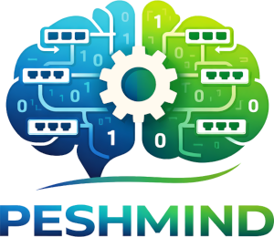

# PeshMind

<p align="center">
  
</p>

**Prolog-based Engine for System & Host Management and INference Daemon**

PeshMind is a network topology discovery and analysis tool that uses Prolog inference to reconstruct LAN network topology based solely on MAC addresses observed by network switches. The system combines a Go-based CLI application with a Prolog reasoning engine to identify network connections, internal/edge switches, and potential ghost switches in the network infrastructure.

## Table of Contents

- [Features](#features)
- [Architecture](#architecture)
- [Prerequisites](#prerequisites)
- [Installation](#installation)
- [Configuration](#configuration)
- [Usage](#usage)
  - [List Switches](#list-switches)
  - [Update Switch Data](#update-switch-data)
  - [Serve Prolog Engine](#serve-prolog-engine)
  - [Query the Network](#query-the-network)
  - [Generate Network Topology Visualization](#generate-network-topology-visualization)
  - [Simulate Network Topology](#simulate-network-topology)
- [Prolog Inference Rules](#prolog-inference-rules)
- [Configuration File Format](#configuration-file-format)
- [License](#license)

## Features

- **Automatic Network Topology Discovery**: Infers network connections from MAC address tables
- **Prolog-based Reasoning**: Uses logical inference to determine switch relationships and connectivity
- **Ghost Switch Detection**: Identifies switches that exist in the network but are not directly managed
- **Network Visualization**: Generates DOT files for graphical network topology representation
- **Simulation Mode**: Test and validate network topologies using simulated switch data
- **Multiple Switch Models Support**: Supports various switch models with customizable data fetching templates
- **RESTful Prolog Engine**: Serves Prolog queries via HTTP using Pengines

## Architecture

PeshMind consists of three main components:

1. **Go CLI Application**: Manages switches, fetches data, and interacts with the Prolog engine
2. **Prolog Inference Engine**: Analyzes MAC address relationships and infers network topology
3. **Knowledge Base**: Stores switch and MAC address data in Prolog facts

and of two possible workflows:

#### The network analysis workflow:

1. Fetch MAC address tables from physical switches
2. Convert switch data to Prolog facts (`switch/1`, `switchname/2`, `seen/3`)
3. Load facts into Prolog engine with inference rules
4. Query the engine to discover topology, connectivity, and ghost switches
5. Visualize results using DOT graphs

#### The simulation workflow:

1. Load a predefined network topology from a DOT file
2. Generate Prolog facts based on the simulated topology
3. Run inference to validate the topology and test edge cases

## Installation and Setup

### Prerequisites

- **Go**: Version 1.23.3 or higher
- **SWI-Prolog**: Required for the Prolog inference engine
- **Expect**: Used for automated switch SSH sessions (included in templates)
- **Graphviz** (optional): For rendering DOT files to images

### Installation

1. Clone the repository:

```bash
git clone https://github.com/mmirko/peshmind.git
cd peshmind
```

2. Build the application:

```bash
go build -o peshmind
```

3. (Optional) Install globally:

```bash
sudo cp peshmind /usr/local/bin/
```

if you want to run `peshmind` from any directory. In this case, make sure to create the configuration file in your working directory and to have the `kbpool` directory for storing Prolog facts.

## Configuration

Both the network analysis and simulation workflows require a configuration file to define switches, their properties, and the Prolog engine endpoint.
Create a `peshmind.json` configuration file in your working directory:

```json
{
  "debug": true,
  "endpoint": "http://localhost:3030/pengine",
  "switches": {
    "switch-01": {
      "name": "switch-01",
      "mac": "aabbccddeeff",
      "description": "Core Switch Floor 1",
      "ip": "192.168.1.10",
      "username": "admin",
      "password": "ask",
      "model": "HP-Aruba",
      "port": 48,
      "extraports": [],
      "data": ""
    }
  }
}
```

### Configuration Fields

- **debug**: Enable verbose output
- **endpoint**: URL of the Prolog Pengines HTTP endpoint
- **switches**: Dictionary of switch configurations
  - **name**: Unique switch identifier
  - **mac**: Switch MAC address (without separators)
  - **description**: Human-readable description
  - **ip**: Management IP address
  - **username**: SSH/telnet username
  - **password**: SSH/telnet password (use "ask" for interactive input)
  - **model**: Switch model
  - **port**: Number of physical ports
  - **extraports**: Additional ports to monitor
  - **data**: Internal field for fetched data

## Usage

### List Switches

Display all configured switches:

```bash
peshmind list
```

### Serve Prolog Engine

Start the Prolog inference engine with HTTP endpoint:

```bash
peshmind serve --kbpool kbpool
```

This will:

1. Check for SWI-Prolog installation
2. Create consolidated knowledge base (`data.pl`)
3. Start Prolog HTTP server on port 3030
4. Wait for queries via Pengines interface

Press `Ctrl+C` to stop the server.

### Query the Network

Query the running Prolog engine for network topology information:

```bash
# Find all switches
peshmind query "switch(X)"

# Find switch names
peshmind query "switchname(X,Name)"

# Find directly connected switches
peshmind query "directn(Switch1,Switch2)"

# Find switches with specific relationships
peshmind query "directpn(X,Y,PortX,PortY)"

# Detect ghost switches
peshmind query "ghostn(X,Y)"

# Identify edge switches
peshmind query "edgeswitchn(X)"

# Identify internal switches
peshmind query "internalswitchn(X)"
```

### Generate Network Topology Visualization

Generate a DOT file representing the physical network topology:

```bash
peshmind dot > network.dot
```

Render to image:

```bash
dot -Tpng network.dot -o network.png
# or
neato -Tpng network.dot -o network.png
```

The DOT output includes:

- Switches in clusters with their ports
- Physical connections between ports
- Ghost switches (unmanaged intermediate switches)
- Color-coded representation


### Update Switch Data (analysis workflow)

Fetch MAC address tables from switches and save to knowledge base:

```bash
# Update a specific switch
peshmind update --switch switch-01

# Update all switches
peshmind update --switch all
```

The command will:

1. Prompt for admin password if configured as "ask"
2. Connect to switch via SSH
3. Fetch MAC address table
4. Parse and convert to Prolog facts
5. Save to `kbpool/<switch-name>.pl`


### Simulate Network Topology (simulation workflow)

Test and validate network topologies using simulation mode:

```bash
# Basic simulation
peshmind simulate --simname simpool/topology4.dot

# With DOT visualization output
peshmind simulate --simname simpool/topology4.dot --emit-dot topology4-sim.dot

# With Prolog facts output
peshmind simulate --simname simpool/topology4.dot --output topology4.pl

# Control generation percentage (for testing partial networks)
peshmind simulate --simname simpool/topology4.dot --sim-generate-percentage 75
```

Simulation topology files use DOT format with special attributes:
- `ghost="true"`: Mark ghost switches
- `port="N"`: Specify connection port
- `mac="..."`: MAC address for ghost switches

## Prolog Inference Rules

The system uses several Prolog predicates to infer network topology:

### Base Facts

- `switch(MacAddr)`: Declares a switch exists
- `switchname(MacAddr, Name)`: Associates a MAC address with a switch name
- `seen(SwitchMac, DeviceMac, Port)`: Records that a switch saw a MAC address on a specific port

### Inferred Predicates

- **`far(X,Y)`**: Two switches are separated by an intermediate switch
- **`direct(X,Y)`**: Two switches are directly connected (not far)
- **`directp(X,Y,PortX,PortY)`**: Direct connection with specific port information
- **`ghost(X,Y)`**: Unmanaged switch detected between X and Y
- **`internalswitch(X)`**: Switch connected to multiple other switches
- **`edgeswitch(X)`**: Switch connected to only one other switch (access layer)
- **`edgeswitchp(X,Port)`**: Edge switch with specific port

All predicates have `*n` variants that use switch names instead of MAC addresses (e.g., `directn/2`, `ghostn/2`).

## License

Copyright © 2026 Mirko Mariotti <mirko@mirkomariotti.it>

This project is licensed under the Apache License 2.0. See the [LICENSE](LICENSE) file for details.